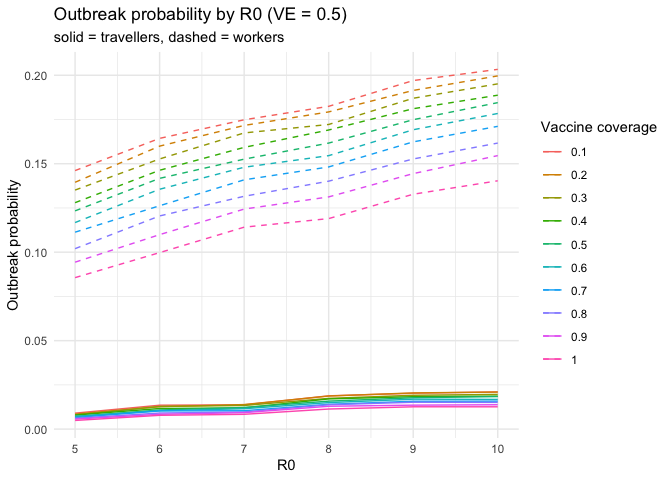

<!-- README.md is generated from README.Rmd. Please edit that file -->

# quarantinesim

<!-- badges: start -->

<!-- badges: end -->

`quarantinesim` provides a **ready-to-use dataset** of quarantine
outbreak scenarios that can be explored through both R and a built-in
Shiny app.

The dataset has already been merged and cleaned, and each row represents
a simulated epidemiological scenario defined by:

- **R0** : basic reproduction number  
- **VE** : vaccine effectiveness  
- **coverage** : vaccination coverage proportion

It also includes modelled outputs such as:

- `traveller_ob_prob`: outbreak probability from travellers  
- `worker_ob_prob`: outbreak probability from quarantine workers  
- `chance50`: time or iteration when outbreak probability reaches 50%  
- `chance95`: time or iteration when outbreak probability reaches 95%

The package is designed for **exploratory data analysis and
visualisation**, and it includes a **Shiny app** that allows users to
interactively explore how outbreak risk changes with **coverage, R0, and
VE**, and to switch between different outcomes (probabilities and
time-to-outbreak).

## Installation

You can install the development version of `quarantinesim` from GitHub
with:

``` r
# install.packages("pak")
pak::pak("ETC5523-2025/assignment-4-packages-and-shiny-apps-Melisa-ops")
```

Or, if you are working locally inside the package project:

``` r
install.packages("devtools")  # if not installed yet

devtools::install()
```

Then load the package:

``` r
library(quarantinesim)
```

The app lets you:

- select a vaccine coverage,
- choose which outcome to display (traveller, worker, chance50,
  chance95),
- and switch chart type (line, point, bar), while also viewing the
  filtered data in a separate tab.

## Example

``` r
library(quarantinesim)

# load dataset shipped with the package
data("data_quarantine")

# see sample of data
head(data_quarantine)
#>          key R0  VE coverage traveller_ob_prob worker_ob_prob chance50
#> 1  5_0.5_0.1  5 0.5      0.1           0.00903        0.14613 46.27000
#> 2  6_0.5_0.1  6 0.5      0.1           0.01352        0.16433 29.48333
#> 3  7_0.5_0.1  7 0.5      0.1           0.01370        0.17484 25.76167
#> 4  8_0.5_0.1  8 0.5      0.1           0.01881        0.18244 20.28667
#> 5  9_0.5_0.1  9 0.5      0.1           0.02028        0.19702 15.72000
#> 6 10_0.5_0.1 10 0.5      0.1           0.02102        0.20334 15.06333
#>    chance95
#> 1 198.82600
#> 2 128.46667
#> 3 108.34800
#> 4  87.98933
#> 5  68.72667
#> 6  64.61433

# outbreak probability by R0 for VE =0.5
data_quarantine |>
  dplyr::filter(VE == 0.5) |>
  ggplot2::ggplot(ggplot2::aes(x = R0)) +
  ggplot2::geom_line(ggplot2::aes(y = traveller_ob_prob, colour = factor(coverage))) +
  ggplot2::geom_line(
    ggplot2::aes(y = worker_ob_prob, colour = factor(coverage)),
    linetype = "dashed"
  ) +
  ggplot2::labs(
    y = "Outbreak probability",
    colour = "Vaccine coverage",
    title = "Outbreak probability by R0 (VE = 0.5)",
    subtitle = "solid = travellers, dashed = workers"
  ) +
  ggplot2::theme_minimal()
```



## Launch the Shiny app

To explore the data interactively, run:

``` r
run_quarantinesim()
```

(Make sure you have inst/app/app.R and an exported run_quarantinesim()
function in R/.)

## Overview of components

- data_quarantine : final dataset containing merged outbreak scenarios
- run_quarantinesim() : launches the interactive Shiny app
- Shiny app in inst/app/ : UI to explore outbreak probabilities across
  R0, VE, and coverage
- Package documentation : created with roxygen2 for data and functions
